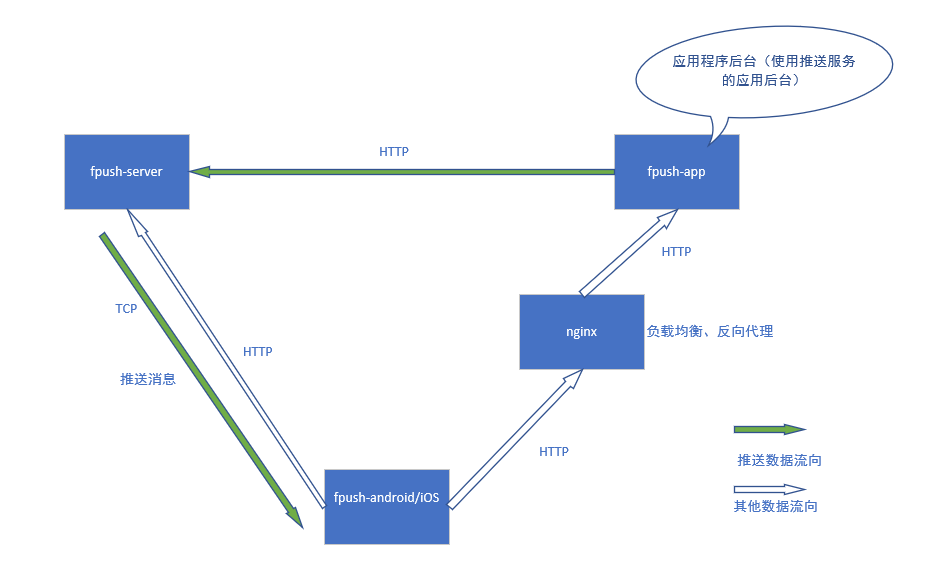
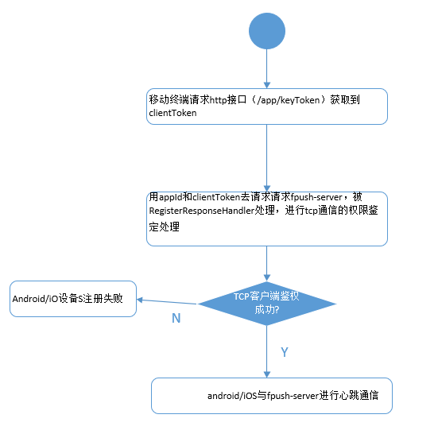
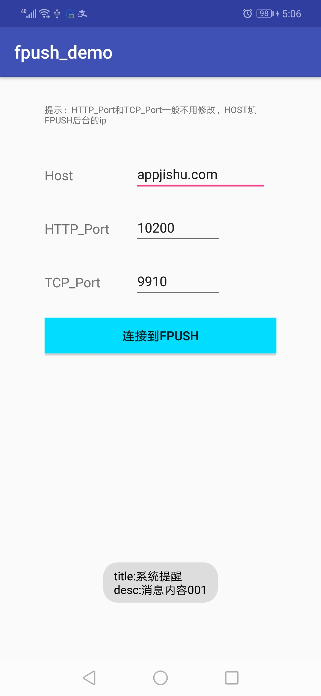

# fpush

fpush是即时消息推送服务程序.  
旨在做一个类似于极光推送，小米推送之类的Java程序开源实现。基于Netty + protobuf
 
👉 [fpush源码解析与使用(中文)](https://github.com/flylib/fpush/blob/master/README-CH.md)

fpush监控后台 
👉 [http://fpush-admin.appjishu.com](http://fpush-admin.appjishu.com)
 

## 技术栈
1. JDK1.8  
2. Netty-4.1.31.Final  
3. protobuf-java 3.6.1  

## 代码简介
fpush-core 核心类库，protobuf原型类  
fpush-server server端， 接受来自自己的应用服务器的http推送请求，并把请求转换成netty的socket发送给fpush-client
实现消息推送，即时通讯技术。 
fpush-client 客户端，模拟App或者网页，或者桌面应用的客户端  

## 系统架构

### 1.系统部署架构图如下：
  

 
 
 

### 2. 移动客户端鉴定权限原理
  

 
 
 

### 3. server端推送消息到client端的原理  
tcp通信图如下:
  

 

👉  [fpush源码解析与使用(中文)](https://github.com/flylib/fpush/blob/master/README-CH.md)

## 运行
eclipse/IDEA里  
Step1 右键run as--java application-- FpushServerApp.java  
Step2 右键run as--java application-- FpushClientApp.java  

Step3 后台发送消息给fpush-client (用来模拟android，ios或者网页，或者java应用的消息客户端)
浏览器访问    <a href="http://localhost:10200">http://localhost:10200</a>  
显示Welcome to fpush application!，  说明server运行起来了 
然后浏览器请求
<a href="http://localhost:10200/app/push?receiverAlias=lsm001&title=系统提醒&desc=消息内容001&data=abc">
http://localhost:10200/app/push?receiverAlias=lsm001&title=系统提醒&desc=消息内容001&data=abc
 </a>
 
 
  
 如果浏览器返回OK
 并且fpush-client打印出下面的信息，说明推送消息成功
<pre><code>
2018-11-19 14:28:44.792  INFO 27780 --- [ntLoopGroup-2-1] c.a.f.client.handler.PushConfirmHandler  : --->>>这是推送到客户端的消息:title=fpush-Demo
2018-11-19 14:29:17.067  INFO 27780 --- [ntLoopGroup-2-1] c.a.f.client.handler.PushConfirmHandler  : --->>>这是推送到客户端的消息:description=这是一条推送给lsm001的消息!
</code></pre>

Step4 Android演示  

 
演示视频如下[demo.mp4](https://github.com/flylib/fpush/blob/master/doc/demo.mp4)

server效果图
 

  
client在eclipse上调试的效果图-eclipse console可以显示中文字符 
 

  

## 测试
注册一个应用账号，手机号是15600000000
 
http://localhost:10200/app/registerAccount?mobilePhone=15600000000

http://localhost:10200/app/secretToken?appId=517723931931574272&appSecretKey=cb2eb85b362941f1b3e1

 
http://localhost:10200/app/keyToken?appId=517723931931574272&appKey=9f5d74bb0f68
   

然后浏览器请求
<a href="http://localhost:10200/app/push?receiverAlias=lsm001&title=系统提醒&desc=消息内容001&data=abc">
http://localhost:10200/app/push?receiverAlias=lsm001&title=系统提醒&desc=消息内容001&data=abc
 </a>
   
查看所有的netty channel连接情况, 浏览器输入下面的网址
 <code>http://appjishu.com:10200/monitor/channelList</code>
 

Android客户端演示可以直接使用apk文件装到自己的android手机上去 
[fpush-android-demo.apk](https://github.com/flylib/fpush/blob/master/fpush-android-demo/app/release/fpush-android-demo.apk)
 
里面的测试host就是我个人的服务器<code>host:appjishu.com</code>
 

fpush监控后台 
👉 [http://fpush-admin.appjishu.com](http://fpush-admin.appjishu.com)
 
## Done List
🚩🚩🚩
1. netty+protobuf  
protobuf的解码ProtobufVarint32FrameDecoder,ProtobufDecoder  
protobuf的编码ProtobufVarint32LengthFieldPrepender,ProtobufEncoder   

2. 心跳机制的实现  
client端经过HeartBeatResponseHandler新建线程，定期发出心跳请求 
server端的HeartBeatResponseHandler监听心跳并作出响应 
 <b/>

4. 客户端长连接的鉴权  
客户端(即fpush-client)发送appId + appKey，经后台鉴定权限通过后，获取到clientToken  
fpush-client与fpush-server通信的时候, RegisterRequestHandler和HeartBeatRequestHandler里面需要带上 
appId+clientToken
建立长连接后，最好所有的RequestHandler需要带上appId+clientToken  

5. 应用服务端的http连接的鉴权  
应用服务端（即app server）发送appId + appSecretKey，经后台鉴定权限通过后，获取到appToken
应用服务端每次调用fpush-server的api都需要带上appId+appToken
 

## TODO list
1. 需要在FHeader里增加msgId
 
2. 增加IdleStateHandler来对heartbeat进行监控，设定的时间间隔内没有收到心跳，就断开连接
Netty的IdleStateHandler会根据用户的使用场景，启动三类定时任务，分别是：ReaderIdleTimeoutTask、WriterIdleTimeoutTask和AllIdleTimeoutTask，它们都会被加入到NioEventLoop的Task队列中被调度和执行。
 
3. server端长连接的超时时间的设置 
我们是长连接服务，手机端和服务端要维持这个长连接，需要定期的发送心跳消息，我们为了节约电量和流量，手机端采用的是智能心跳模式。那么对服务端来说，它是不知道手机端下次是几分钟之后会发送心跳上来的，那么这个连接在服务端的超时时间应该设置多久就是一个问题了。
客户端在每一次的心跳消息中携带下一次的心跳时间。服务端就根据这个时间来设置连接的超时时间。
 
