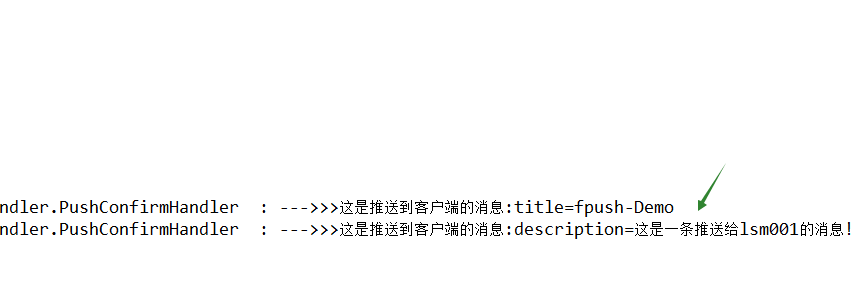

# fpush

fpush是即时消息推送服务程序. <br/>
旨在做一个类似于极光推送，小米推送之类的Java程序开源实现。基于Netty + protobuf
<br/>

## 技术栈
1. JDK1.8 <br/>
2. Netty-4.1.31.Final <br/>
3. protobuf-java 3.6.1 <br/>

## 代码简介
fpush-core 核心类库，protobuf原型类 <br/>
fpush-server server端， 接受来自自己的应用服务器的http推送请求，并把请求转换成netty的socket发送给fpush-client
实现消息推送，即时通讯技术。<br/>
fpush-client 客户端，模拟App或者网页，或者桌面应用的客户端 <br/>

## 运行
eclipse/IDEA里 <br/>
Step1 右键run as--java application-- FpushServerApp.java <br/>
Step2 右键run as--java application-- FpushClientApp.java <br/>

Step3 后台发送消息给fpush-client (用来模拟android，ios或者网页，或者java应用的消息客户端)
浏览器访问    <a href="http://localhost:10200">http://localhost:10200</a> <br/>
显示Welcome to fpush application!，  说明server运行起来了<br/>
然后浏览器请求
 <a href="http://localhost:10200/api/pushTest">http://localhost:10200/api/pushTest</a>
 <br/>
 如果浏览器返回OK
 并且fpush-client打印出下面的信息，说明推送消息成功
<pre><code>
2018-11-19 14:28:44.792  INFO 27780 --- [ntLoopGroup-2-1] c.a.f.client.handler.PushConfirmHandler  : --->>>这是推送到客户端的消息:title=fpush-Demo
2018-11-19 14:29:17.067  INFO 27780 --- [ntLoopGroup-2-1] c.a.f.client.handler.PushConfirmHandler  : --->>>这是推送到客户端的消息:description=这是一条推送给lsm001的消息!
</code></pre>

Step4 Android演示

<video id="video" controls="" preload="none" poster=doc/post.jpg">
<source id="mp4" src="doc/demo.mp4" type="video/mp4">
</video>

<br/>

server效果图<br/>

<br/>
client在eclipse上调试的效果图-eclipse console可以显示中文字符<br/>

<br/>

## 测试
注册一个应用账号，手机号是15600000000
<br/>
http://localhost:10200/app/registerAccount?mobilePhone=15600000000

http://localhost:10200/app/secretToken?appId=517723931931574272&appSecretKey=cb2eb85b362941f1b3e1

<br/>
http://localhost:10200/app/keyToken?appId=517723931931574272&appKey=9f5d74bb0f68
<br/>

## Done List
1. netty+protobuf <br/>
protobuf的解码ProtobufVarint32FrameDecoder,ProtobufDecoder <br/>
protobuf的编码ProtobufVarint32LengthFieldPrepender,ProtobufEncoder <br/><br/>

2. 心跳机制的实现 <br/>
client端经过HeartBeatResponseHandler新建线程，定期发出心跳请求<br/>
server端的HeartBeatResponseHandler监听心跳并作出响应<br/>

3. server端推送消息到client端 <br/>
客户端使用PushConfirmHandler处理 <br/>

服务端 <br/>

RegisterResponseHandler中channelRead()里，如果客户端注册成功则把channel对象保存到NettyChannelMap这个Map里去
```java
String clientId = header.getAlias();
			ctx.channel().attr(ChannelAttrKey.KEY_CLIENT_ID).set(clientId);
			NettyChannelMap.put(clientId, ctx.channel());
```


应用服务器通过访问 http接口 http://localhost:10200/api/** <br/>
后台ApiController把消息的内容写入缓存ToSendMap.aliasMap中去，如
<code>ToSendMap.aliasMap.put(alias, list);</code> <br/>

定时任务<code>com.appjishu.fpush.server.boot.SendTask#scan</code>每隔一定的时间间隔，会扫描ToSendMap.aliasMap<br/>
里的待发送的消息.  遍历后，会通过<code>NettyChannelMap.get(alias)</code>获取到Channel,然后 channel.writeAndFlush(message) <br/>
发送出去

```java
@Scheduled(fixedRate = 5000)
    public void scan() {
        for (Map.Entry<String, List<MsgData>> entry: ToSendMap.aliasMap.entrySet()) {
            String alias = entry.getKey();
            List<MsgData> msgList = entry.getValue();
            if (StringUtils.isNotEmpty(alias) && msgList != null && msgList.size() > 0) {
                pushService.doPush(msgList, alias);
            }
        }

    }
```


```java
public void doPush(List<MsgData> msgList, String alias) {
        FMessage fMessage = buildPushMessage(msgList, alias);
        if (fMessage != null) {
            log.info("---TringToDoPush()--->");
            Channel channel = NettyChannelMap.get(alias);
            if (channel == null) {
                log.info("------channelIsNull---");
            } else if (!channel.isWritable()) {
                log.info("------channelIsNotWritable---");
            } else {
                ChannelFuture future = channel.writeAndFlush(fMessage);
                log.info("------msgWriten!!!---");
                future.addListener(new ChannelFutureListener() {
                    public void operationComplete(final ChannelFuture future)
                            throws Exception {
                        if (msgList.size() > 0) {
                            msgList.remove(0);
                            log.info("------removeAreadySentMsg!!!---");
                        }
                    }
                });
            }
        }
    }
```
<br/>
<br/>

4. 客户端长连接的鉴权 <br/>
客户端(即fpush-client)发送appId + appKey，经后台鉴定权限通过后，获取到clientToken <br/>
fpush-client与fpush-server通信的时候, RegisterRequestHandler和HeartBeatRequestHandler里面需要带上<br/>
appId+clientToken
建立长连接后，最好所有的RequestHandler需要带上appId+clientToken <br/>

5. 应用服务端的http连接的鉴权 <br/>
应用服务端（即app server）发送appId + appSecretKey，经后台鉴定权限通过后，获取到appToken
应用服务端每次调用fpush-server的api都需要带上appId+appToken
<br/>

## TODO list
1. 需要在FHeader里增加msgId
<br/>
2. 增加IdleStateHandler来对heartbeat进行监控，设定的时间间隔内没有收到心跳，就断开连接
Netty的IdleStateHandler会根据用户的使用场景，启动三类定时任务，分别是：ReaderIdleTimeoutTask、WriterIdleTimeoutTask和AllIdleTimeoutTask，它们都会被加入到NioEventLoop的Task队列中被调度和执行。
<br/>
3. server端长连接的超时时间的设置<br/>
我们是长连接服务，手机端和服务端要维持这个长连接，需要定期的发送心跳消息，我们为了节约电量和流量，手机端采用的是智能心跳模式。那么对服务端来说，它是不知道手机端下次是几分钟之后会发送心跳上来的，那么这个连接在服务端的超时时间应该设置多久就是一个问题了。
客户端在每一次的心跳消息中携带下一次的心跳时间。服务端就根据这个时间来设置连接的超时时间。
<br/>
